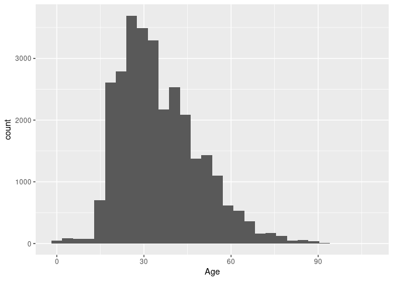

Innocent Death’s caused by Police Project
================
by Abhey , Reuben , Mieke

## Summary

Write-up of your project and findings go here. Think of this as the text
of your presentation. The length should be roughly 5 minutes when read
out loud. Although pacing varies, a 5-minute speech is roughly 750
words. To use the word count addin, select the text you want to count
the words of (probably this is the Summary section of this document, go
to Addins, and select the `Word count` addin). This addin counts words
using two different algorithms, but the results should be similar and as
long as you’re in the ballpark of 750 words, you’re good! The addin will
ignore code chunks and only count the words in prose.

You can also load your data here and present any analysis results /
plots, but I strongly urge you to keep that to a minimum (maybe only the
most important graphic, if you have one you can choose). And make sure
to hide your code with `echo = FALSE` unless the point you are trying to
make is about the code itself. Your results with proper output and
graphics go in your presentation, this space is for a brief summary of
your project.

As of recently, their has been a lot of uproar about the police killing people, for example the recent death of George Floyd that sprouted mass protests. As a result, we decided to choose a data set from kaggle that was called "Innocent Deaths caused by Police". The reason why we chose this dataset is because we wanted our project to be something meaningful and show information that can help put light to an important issue. 

While looking through the data-set we realized that we had a little bit of cleaning to do. The first bit of cleaning that we had to do was to make a zip code that would group countries together since having 50 different states on the x axis would be hard to read and not that effective. As a result, we took the zip code by the first number which grouped states together by geographical location. Additionally, we extracted the year from the date so we could group by year. Finally, we had to mutate the "European-American/White" race since one of the observations had different capitlization, so we added it by changing the capitalization. 

Column state accronym to full state
made a column year
police_zip
police_data

How different factors affect the chances of dying at the hands of the police?

    ## ── Attaching packages ─────────────────────────────────────── tidyverse 1.3.1 ──

    ## ✓ ggplot2 3.3.5     ✓ purrr   0.3.4
    ## ✓ tibble  3.1.5     ✓ dplyr   1.0.7
    ## ✓ tidyr   1.1.3     ✓ stringr 1.4.0
    ## ✓ readr   2.0.0     ✓ forcats 0.5.1

    ## ── Conflicts ────────────────────────────────────────── tidyverse_conflicts() ──
    ## x dplyr::filter() masks stats::filter()
    ## x dplyr::lag()    masks stats::lag()

    ## Warning: One or more parsing issues, see `problems()` for details

    ## Rows: 30860 Columns: 27

    ## ── Column specification ────────────────────────────────────────────────────────
    ## Delimiter: ","
    ## chr (21): Name, Gender, Race, URL of image, Date of injury resulting in deat...
    ## dbl  (5): Unique ID, Age, Location of death (zip code), Latitude, Longitude
    ## lgl  (1): URL Temp

    ## 
    ## ℹ Use `spec()` to retrieve the full column specification for this data.
    ## ℹ Specify the column types or set `show_col_types = FALSE` to quiet this message.

    ## # A tibble: 6 × 27
    ##   `Unique ID` Name       Age Gender Race    `URL of image` `Date of injury resu…
    ##         <dbl> <chr>    <dbl> <chr>  <chr>   <chr>          <chr>                
    ## 1       25747 Mark A.…    21 Male   Africa… <NA>           1/1/2000             
    ## 2       25748 Phillip…    19 Male   Africa… <NA>           1/1/2000             
    ## 3       25746 Samuel …    17 Male   Europe… <NA>           1/1/2000             
    ## 4       25749 Mark Or…    23 Male   Hispan… <NA>           1/1/2000             
    ## 5           1 LaTanya…    24 Female Africa… <NA>           1/2/2000             
    ## 6           2 Lester …    53 Male   Race u… <NA>           1/2/2000             
    ## # … with 20 more variables: Location of injury (address) <chr>,
    ## #   Location of death (city) <chr>, State <chr>,
    ## #   Location of death (zip code) <dbl>, Location of death (county) <chr>,
    ## #   Full Address <chr>, Latitude <dbl>, Longitude <dbl>,
    ## #   Agency or agencies involved <chr>, Highest level of force <chr>,
    ## #   Alleged weapon <chr>, Aggressive physical movement <chr>,
    ## #   Fleeing/Not fleeing <chr>, Description Temp <chr>, URL Temp <lgl>, …

    ## Rows: 6
    ## Columns: 27
    ## $ `Unique ID`                                              <dbl> 25747, 25748,…
    ## $ Name                                                     <chr> "Mark A. Hort…
    ## $ Age                                                      <dbl> 21, 19, 17, 2…
    ## $ Gender                                                   <chr> "Male", "Male…
    ## $ Race                                                     <chr> "African-Amer…
    ## $ `URL of image`                                           <chr> NA, NA, NA, N…
    ## $ `Date of injury resulting in death (month/day/year)`     <chr> "1/1/2000", "…
    ## $ `Location of injury (address)`                           <chr> "Davison Free…
    ## $ `Location of death (city)`                               <chr> "Detroit", "D…
    ## $ State                                                    <chr> "MI", "MI", "…
    ## $ `Location of death (zip code)`                           <dbl> 48203, 48203,…
    ## $ `Location of death (county)`                             <chr> "Wayne", "Way…
    ## $ `Full Address`                                           <chr> "Davison Free…
    ## $ Latitude                                                 <dbl> 42.40453, 42.…
    ## $ Longitude                                                <dbl> -83.09227, -8…
    ## $ `Agency or agencies involved`                            <chr> NA, NA, "Mend…
    ## $ `Highest level of force`                                 <chr> "Vehicle", "V…
    ## $ `Alleged weapon`                                         <chr> NA, NA, NA, N…
    ## $ `Aggressive physical movement`                           <chr> NA, NA, NA, N…
    ## $ `Fleeing/Not fleeing`                                    <chr> NA, NA, NA, N…
    ## $ `Description Temp`                                       <chr> NA, NA, NA, N…
    ## $ `URL Temp`                                               <lgl> NA, NA, NA, N…
    ## $ `Brief description`                                      <chr> "Two Detroit …
    ## $ `Dispositions/Exclusions INTERNAL USE, NOT FOR ANALYSIS` <chr> "Unreported",…
    ## $ `Intended use of force (Developing)`                     <chr> "Pursuit", "P…
    ## $ `Supporting document link`                               <chr> "https://driv…
    ## $ `Foreknowledge of mental illness`                        <chr> "No", "No", "…

    ## `stat_bin()` using `bins = 30`. Pick better value with `binwidth`.

    ## Warning: Removed 1174 rows containing non-finite values (stat_bin).

<!-- -->

## Presentation

Our presentation can be found [here](presentation/presentation.html).

## Data

Include a citation for your data here. See
<http://libraryguides.vu.edu.au/c.php?g=386501&p=4347840> for guidance
on proper citation for datasets. If you got your data off the web, make
sure to note the retrieval date.

## References

List any references here. You should, at a minimum, list your data
source.
